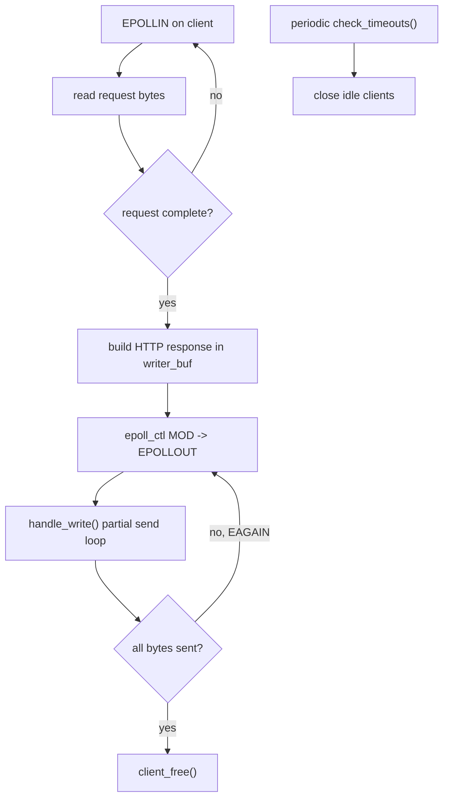

# Day 10 - Timeout + Write Buffer Design

> Focus mode: make the HTTP server safer under slow clients and non-blocking write pressure.

---

## What I Added Today

1. Idle timeout tracking per client using `last_active`.
1. Periodic timeout scan with `check_timeouts()` to close inactive connections.
1. Per-client write buffer fields:
   - `writer_buf`
   - `writer_len`
   - `writer_sent`
1. `EPOLLOUT`-driven partial send logic in `handle_write()`.
1. Safer cleanup in `client_free()` to avoid invalid close/free sequences.

---

## Why Timeout Is Important

In event-driven servers, some clients connect and stop sending data.  
Without timeout cleanup, these idle sockets stay open and slowly consume:

- file descriptors
- memory
- event loop capacity

Using `TIMEOUT_SECONDS` and `last_active` keeps resource usage bounded.

---

## Why Write Buffering Is Important

With non-blocking sockets, `send()` does not guarantee all bytes are written in one call.

The server now:

1. Builds full response (`header + body`) into `writer_buf`.
1. Tries to send immediately.
1. If socket buffer is full (`EAGAIN`/`EWOULDBLOCK`), waits for next `EPOLLOUT`.
1. Continues from `writer_sent` until all bytes are delivered.

This is the correct pattern for edge-triggered `epoll` when responses may be larger than kernel send capacity.

---

## Design View (Flow)

---

## Data Structure Upgrade

`Client` moved from read-only state to bidirectional state:

- Read side: `buf`, `buf_len`, `last_active`
- Write side: `writer_buf`, `writer_len`, `writer_sent`

This separation makes the server easier to extend for future features like keep-alive or chunked streaming.

---

## Reflection

Day 10 is where the server behavior became more production-minded.

- Timeout logic protects the system from idle connection leakage.
- Write-buffer logic makes non-blocking response delivery reliable.
- The event design is now clearer: read path (`EPOLLIN`) and write path (`EPOLLOUT`) are separate and explicit.

---

## Next Step

- Add path sanitization to prevent directory traversal.
- Support large-file streaming without full-file allocation.
- Add structured request logs (`method`, `path`, `status`, `bytes`, `latency`).
