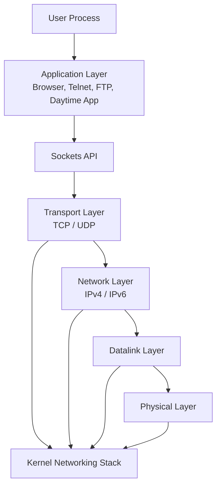

# Day 3 — OSI Model, Sockets Interface, and the TCP Daytime Server

Today I focused less on generic debugging and more on understanding where socket programming fits inside the full networking stack. I studied the OSI model, the Internet protocol suite, why sockets sit between the application and transport layers, and how a simple iterative TCP daytime server accepts a client, sends a reply, and closes the connection.

---

## What I Studied Today

1. I learned the seven layers of the OSI model: physical, datalink, network, transport, session, presentation, and application.
1. I understood that in real Internet programming, the upper three OSI layers are usually grouped together as the application layer.
1. I learned that the lower layers handle communication details such as addressing, acknowledgments, sequencing, checksums, and data delivery.
1. I studied how sockets act as the programming interface between the application layer and the transport layer.
1. I reviewed how a TCP daytime server works: wait in `accept()`, create a connected socket, send the current time, and close the connection.
1. I learned that this kind of server is called an iterative server because it handles one client at a time.

---

## Visual Summary



This diagram summarizes the main idea from today: the application talks to the transport layer through sockets, while the operating system kernel handles most of the lower-level communication work.

---

## TCP Daytime Server Flow

```mermaid
flowchart LR
    A["socket()"] --> B["bind()"]
    B --> C["listen()"]
    C --> D["accept() waits for client"]
    D --> E["Three-way handshake completes"]
    E --> F["accept() returns connfd"]
    F --> G["time() gets current time"]
    G --> H["ctime() formats time"]
    H --> I["snprintf() builds safe output"]
    I --> J["write() sends reply to client"]
    J --> K["close() terminates connection"]
```



---

## Code Pattern I Learned

```c
for (;;) {
    connfd = accept(sockfd, (SA *)&cli, &len);
    ticks = time(NULL);
    snprintf(buff, sizeof(buff), "%.24s\r\n", ctime(&ticks));
    write(connfd, buff, strlen(buff));
    close(connfd);
}
```

This loop shows the core behavior of a simple daytime server. The server sleeps inside `accept()` until a client connects. After the TCP handshake completes, `accept()` returns a new connected descriptor named `connfd`. That descriptor is used only for that client.

---

## What I Learned Today

1. The OSI model is a conceptual way to understand how communication responsibilities are divided into layers.
1. In practical Internet programming, the application usually interacts only with sockets, while the kernel handles most of the lower-level network machinery.
1. TCP belongs to the transport layer, while IPv4 and IPv6 belong to the network layer.
1. `accept()` does not reuse the listening socket for communication. It returns a new connected descriptor for each client.
1. The TCP connection setup uses a three-way handshake, and connection shutdown uses a normal termination sequence.
1. `snprintf()` is safer than `sprintf()` because it protects the output buffer from overflow.
1. A simple daytime server is iterative, meaning it serves one client at a time in sequence.
1. If a server becomes slow, it may need concurrency using `fork()`, threads, or pre-forked worker processes.

---

## Important Ideas

### Why sockets are placed here

Sockets provide the interface between the application and transport layers because this is the natural boundary between application logic and communication logic. The application knows what data it wants to send, while TCP and UDP handle how that data moves across the network.

### Why `accept()` matters

The listening socket waits for incoming connections, but it does not directly handle client data. Once a client connects, `accept()` creates a separate connected socket so the server can communicate with that one client.

### Why safe string functions matter

Today I also learned that functions like `snprintf()` are preferred over older unsafe functions like `sprintf()`. In network programs, unsafe string handling can lead to buffer overflows and security problems.

---

## Reflection

Today gave me a much clearer mental model of network programming. I now understand not only the order of TCP server calls, but also where sockets belong in the bigger architecture of the operating system and protocol stack. This made the daytime server example feel much more meaningful, because I can now connect the C code to the theory behind it.
