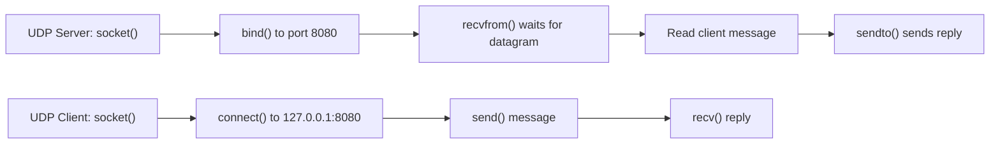

# Day 4 — UDP Client/Server Basics and Finishing Chapter 1

Today I moved from the TCP examples into basic UDP programming in C. I wrote a small UDP server and client, sent a message from the client to the server, received it with `recvfrom()`, and sent the same data back with `sendto()`. I also finished Chapter 1 of *UNIX Network Programming: The Sockets Networking API*.

---

## What I Studied Today

1. I learned how to create a UDP socket using `socket(AF_INET, SOCK_DGRAM, 0)`.
1. I understood that a UDP server still uses `bind()` to attach to an IP address and port.
1. I learned that UDP does not use `listen()` or `accept()` because it is connectionless.
1. I practiced receiving data with `recvfrom()` and replying with `sendto()`.
1. I learned that a UDP client can call `connect()` for convenience so it can use `send()` and `recv()` instead of `sendto()` and `recvfrom()`.
1. I completed Chapter 1 and now have a clearer picture of how the sockets API fits into real network programming.

---

## UDP Flow



This flow helped me see the biggest difference from TCP: there is no connection setup with `listen()` and `accept()` on the server side before data arrives.

---

## Code Pattern I Learned

```c
n = recvfrom(listenfd, buff, sizeof(buff) - 1, 0, (SA *)&cliaddr, &len);
buff[n] = '\0';
sendto(listenfd, buff, strlen(buff), 0, (SA *)&cliaddr, len);
```

This pattern shows the core UDP server idea. The server waits for a datagram, records who sent it, and then sends a reply back to that same client address.

---

## What I Learned Today

1. UDP is connectionless, so there is no handshake before data is exchanged.
1. A UDP server usually works with datagrams directly instead of per-client connected sockets.
1. `recvfrom()` is useful because it gives both the data and the sender's address.
1. `sendto()` uses the stored client address to return a response.
1. A UDP client may optionally use `connect()` even though UDP itself is still connectionless.
1. Using `connect()` with UDP mainly simplifies the client API by letting it use `send()` and `recv()`.
1. TCP and UDP may both use sockets, but the way data is delivered and managed is very different.
1. Finishing Chapter 1 gave me a stronger foundation before moving deeper into later chapters.

---

## Important Ideas

### Why UDP feels simpler

UDP removes the connection management steps found in TCP. That makes the code path shorter, but it also means the application must live without guarantees like reliable delivery, ordering, and retransmission.

### Why `recvfrom()` matters

In a connectionless protocol, the server needs to know where the datagram came from. `recvfrom()` gives both the message and the sender address, which is why it is central to basic UDP servers.

### Why the UDP client used `connect()`

Today I noticed that `connect()` on a UDP socket does not create a full TCP-style connection. Instead, it tells the kernel which peer this socket will talk to, so `send()` and `recv()` can be used more conveniently.

---

## Reflection

Today helped me separate TCP habits from UDP thinking. TCP is about connections and stream communication, while UDP is about sending independent packets with much less setup. Finishing Chapter 1 also feels like an important milestone because I now have a stronger conceptual base for the rest of the book.
