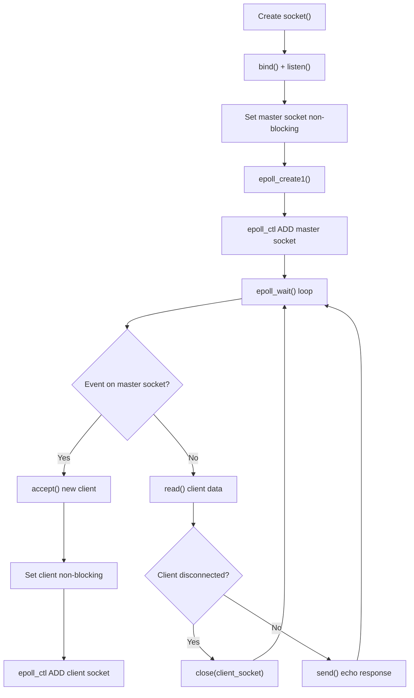

# Day 6 - Building `Tcp_epoll_server.c` from Scratch

Today I completed the `Tcp_epoll_server.c` file end-to-end. I built a TCP echo server using `epoll` in edge-triggered mode, and organized the code into clear functions for setup, accepting clients, and handling client data.

The goal of this file was to move from `select()` style thinking to a more scalable event-driven model where one process can monitor multiple sockets efficiently.

---

## What I Did Today

1. I created and configured the listening TCP socket on port `8080`.
1. I added non-blocking mode using `fcntl(..., O_NONBLOCK)`.
1. I initialized `epoll` with `epoll_create1()` and registered the master socket.
1. I implemented accepting new clients and adding each client socket to the `epoll` watch list.
1. I implemented client read handling and echo response with `send()`.
1. I built the main event loop using `epoll_wait()` to dispatch socket events.

---

## What Changed Today

- Added a complete `epoll`-based TCP server implementation in `Tcp_epoll_server.c`.
- Structured the program into reusable functions:
- `set_nonblocking()`
- `setup_server()`
- `setup_epoll()`
- `accept_new_connection()`
- `handle_client_data()`
- `main()` as the event loop controller.

---

## Visual Summary (Picture of Server Flow)

This picture shows the exact runtime behavior of the server: initialize once, then react to events in a continuous `epoll_wait()` loop.

---

## File Explanation (`Tcp_epoll_server.c`)

### 1) `set_nonblocking(int fd)`

Uses `fcntl()` to read existing flags and set `O_NONBLOCK`. This is required so sockets do not block the whole process.

### 2) `setup_server(int port)`

Creates the master socket, enables `SO_REUSEADDR`, binds to `INADDR_ANY:8080`, starts listening, then returns the listening file descriptor.

### 3) `setup_epoll(int master_socket)`

Creates an `epoll` instance and registers the master socket with `EPOLLIN` so the server is notified when new clients are ready to be accepted.

### 4) `accept_new_connection(int epoll_fd, int master_socket)`

Accepts incoming client connections, sets each new client socket to non-blocking mode, and adds it to `epoll` with `EPOLLIN | EPOLLET`.

### 5) `handle_client_data(int client_socket)`

Reads incoming data from the client:
- If `read()` returns `0`, the client disconnected, so the socket is closed.
- If data exists, the server prints it and echoes it back using `send()`.
- If non-blocking read is temporarily unavailable (`EAGAIN` / `EWOULDBLOCK`), it does not treat that as a fatal error.

### 6) `main()`

Starts the server and epoll, then runs forever:
- waits for ready events with `epoll_wait()`
- dispatches event handling either to accept new clients or process existing client data.

---

## Reflection

Today was a major practical step. I did not only review concepts, I built a full working event-driven server using `epoll`. This helped me connect the theory of non-blocking sockets and I/O multiplexing to real C code structure.

After finishing this file, I have a clearer foundation for the next step: improving robustness (full edge-triggered read loops, better error handling, and cleaner client lifecycle management).
