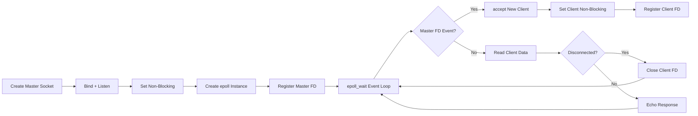

# Day 7 - Structuring and Polishing the `epoll` Server

Today I focused on design quality, not just "making it run."  
The goal was to shape the `epoll` server into a clean mental model: setup phase, event loop phase, and connection lifecycle phase.

---

## Objectives

1. Improve code organization so each function has one clear responsibility.
1. Keep the non-blocking + `epoll` behavior easy to reason about.
1. Make the project notes cleaner for fast revision later.

---

## Server Design View

This design keeps the runtime behavior predictable: initialize once, then react to events forever.

---

## What I Improved

- Broke the server workflow into focused steps (`setup`, `accept`, `read`, `dispatch`).
- Reinforced why non-blocking sockets are required for event-driven servers.
- Reviewed how `EPOLLIN` and edge-triggered mode affect read behavior.
- Organized notes so future revision is faster and less confusing.

---

## Key Concepts Reinforced

- `epoll` scales better than `select()` for many file descriptors.
- Non-blocking mode prevents one slow client from freezing the whole server.
- The master socket only accepts new clients; client sockets handle payload I/O.
- Clear function boundaries make debugging and upgrades much easier.

---

## Reflection

Day 7 was about engineering discipline: better structure, better readability, and better long-term maintainability.  
This is the stage where networking code starts to feel like a system, not a single script.

---

## Next Step

Implement a robust read loop for edge-triggered sockets (read until `EAGAIN`) and add cleaner client disconnect handling.
