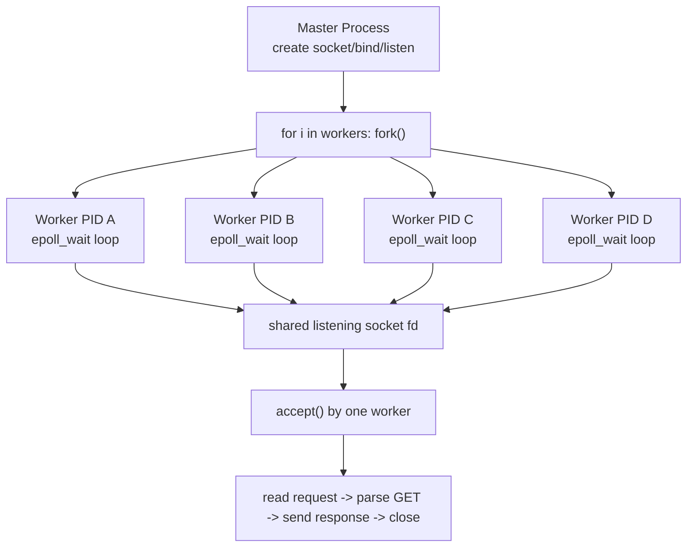

# Day 9 - `fork()` Deep Dive and Server Design

> Focus mode: understand `fork()` not only as an API call, but as a process design tool.

---

## What I Built Today

I built and reviewed `http_server_fork.c`: a multi-process HTTP server model where:

1. The master process creates one listening socket on port `8080`.
1. The master calls `fork()` in a loop to create multiple worker processes.
1. Every worker has its own `epoll` instance and waits for events.
1. Workers share the same listening socket (inherited across `fork`) and compete to `accept()` new connections.
1. Each accepted client is handled by one worker, served, then closed.

This is a classic pre-fork style architecture.

---

## Mental Model of `fork()`

`fork()` makes a new process by duplicating the calling process.

- Parent gets return value: `pid > 0` (child PID)
- Child gets return value: `0`
- On failure: `-1`

After `fork()`, parent and child continue from the next line of code, but as separate processes.

Important: memory is logically copied, but Linux uses copy-on-write (COW), so pages are only physically copied when modified.

---

## Visual: `fork()` Inside a Loop

If parent does:

```c
for (int i = 0; i < 4; i++) {
    pid_t pid = fork();
    if (pid == 0) {
        // child path
        break;
    }
}
```

The intent is:

- Parent spawns one child per loop iteration.
- Child breaks and does worker logic.
- Parent continues loop until all workers are created.

Your code uses this pattern to create `workers = 4`.

---

## Process-Level Architecture



Design point: the listening socket is inherited by all children, so kernel wakes workers when connections arrive. One worker wins `accept()`.

---

## Why This Design Is Useful

- Multi-core usage: separate processes can run on different CPU cores.
- Fault isolation: crash in one worker may not kill all workers.
- Simpler than threading for some workloads (independent address spaces).
- Useful stepping stone before advanced models (thread pools, async runtimes, process managers).

---

## Deep `fork()` + Socket Notes

1. File descriptors are inherited:
   - Child receives duplicates referencing same open file description.
   - Listening socket can be accepted by all workers.
1. Each process has its own user-space memory:
   - `clients[]` array is per worker, not globally shared between workers.
1. `epoll` fd is per worker:
   - In your code, `setup_epoll(master_socket)` runs after `fork()` in each child.
1. Parent currently waits forever with `wait(NULL)`:
   - Good for learning lifecycle; in production, signal handling + controlled restart is preferred.

---

## Tradeoffs and Risks in Current Version

- Thundering herd risk:
  Multiple workers may wake on incoming connection, but only one accepts.
- Static file loading:
  Entire file is read into memory before send; large files can be expensive.
- Path safety:
  URL path is concatenated to `BASE_DIR`; needs stronger path sanitization for production.
- Linux-specific helper:
  `memmem()` is not portable to all systems.

---

## Reflection

Day 9 moved from "single event loop server" to "OS process architecture."

The biggest idea: `fork()` is a design decision, not just a function call.  
It changes failure boundaries, concurrency shape, memory behavior, and how sockets are shared.

---

## References

- YouTube reference used: https://www.youtube.com/watch?v=94URLRsjqMQ
- Stack Overflow visual explanation: https://stackoverflow.com/questions/26793402/visually-what-happens-to-fork-in-a-for-loop
- Linux man pages: `man 2 fork`, `man 2 accept`, `man 7 epoll`

